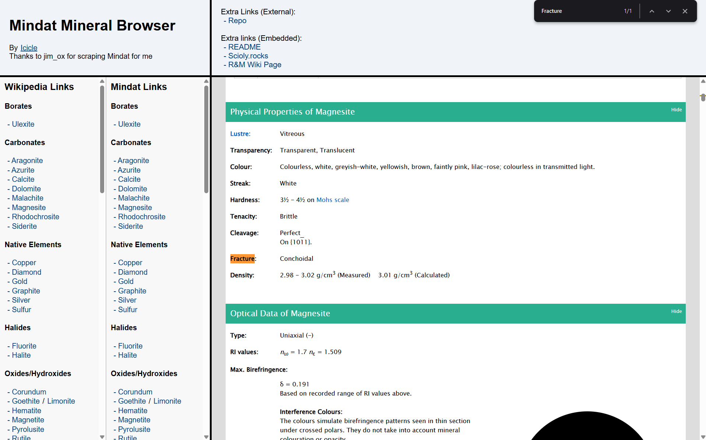
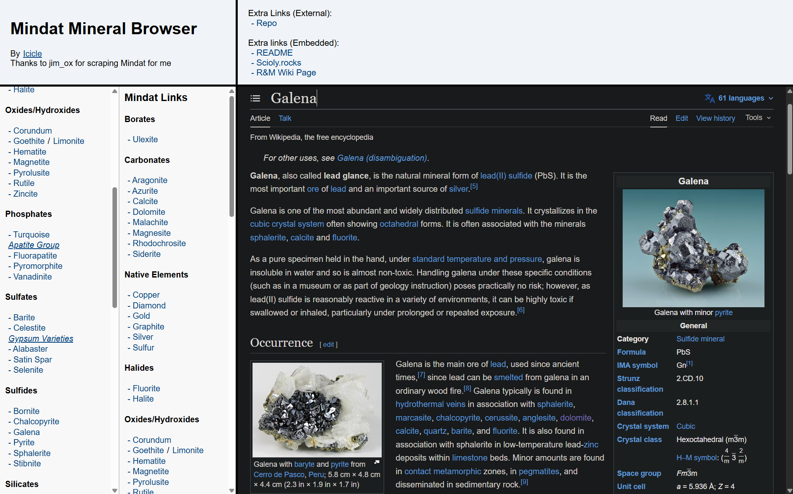

# MineralBrowse
SciOly mineral extravaganza by Icicle 
Also credited: jim_ox for scraping mindat for me

---

[Use Now](https://ic1cl3.github.io/MineralBrowse/)

This is an almost useless static site I threw together for browsing the Mindat and wikipedia pages of Scioly minerals. I will add a rocks version if anyone actually uses this, but I probably won't. Contact me on discord if you want a rocks version. I made this because I was too lazy to make a sidebar chrome extension.

Note that some of the mindat displays (e.g. grain simulation and molecular structure) will not work as the embed has scripts disabled.

 

AI Use:
 - AI was used twice in this project - once to generate the first wikipedia list and once to rearrange the sidebars to be under the header. The sidebars was a mix of copilot explaining what to do and doing some of it because I wasn't entirely sure how to accomplish the goal. The wikipedia list was simply writing out that list because I didn't want to go through the tedium of writing out dozens and dozens of entries and pasting their wikipedia links by hand. That part was completely designed by me but completely "typed" by AI.